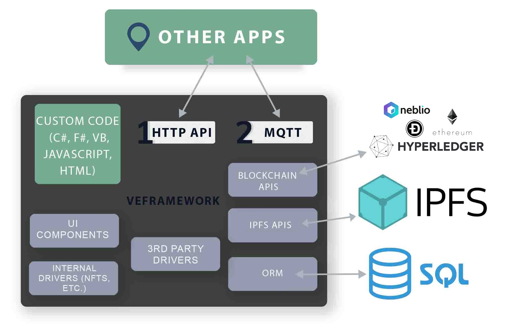

[](https://www.nuget.org/packages/VEFramework.VEDriversLite/)
[](https://www.nuget.org/packages/VEFramework.VEBlazor/)

# VEFramework

Virtual Economy framework will help you to create applications related to Web3, Blockchains, IoT, NFTs, Cryptocurrencies and other useful technologies.

VEFramework works with multiple blockchains. Now it has support of Neblio and Dogecoin (L2)



## Použití

- [`VEDriversLite`](https://docs.veframework.com/VEDriversLite/api/index.html) - Aktuální a doporučená verze (Neblio a NFT drivers)

```shell
dotnet add package VEFramework.VEDriversLite --version 0.3.21
```
- [`VEBlazor`](https://github.com/fyziktom/VirtualEconomyFramework/tree/main/VirtualEconomyFramework/VEBlazor) - Blazor knihovna komponent a dApp template

```shell
dotnet add package VEFramework.VEBlazor --version 0.3.21
```

Zkuste si náš [hello world příklad](#hello-world-with-vedriverslite).

Více informací najdete na

- [Wiki](https://github.com/fyziktom/VirtualEconomyFramework/wiki)
- [Swagger API dokumentaci](./VEconomy-swagger.json)
- [Readme VEconomy](https://github.com/fyziktom/VirtualEconomyFramework/tree/main/VirtualEconomyFramework/VEconomy#veconomy-application)
- [Readme VBlazor](https://github.com/fyziktom/VirtualEconomyFramework/tree/main/VirtualEconomyFramework/VEBlazor)

### Docker

- [Dockerizace VENFT serveru](https://github.com/fyziktom/VirtualEconomyFramework/wiki/Dockerizing-VENFT-APP-Server)
- [Dockerizace Nebliod (Neblio Blockchain)](https://github.com/fyziktom/VirtualEconomyFramework/wiki/Dockerizing-Nebliod)
- [Dockerizace IPFS](https://github.com/fyziktom/VirtualEconomyFramework/wiki/Dockerizing-IPFS)
- [Použití `docker-compose` ke spuštění VENFT serveru, Nebliod a IPFS](https://github.com/fyziktom/VirtualEconomyFramework/wiki/Docker-Compose---VENFTAPP-Server,-Nebliod,-IPFS-Node)

## VENFT online demo

<p align="center">
  
<p>

Webová peněženka s integrovaným NFT marketplacem a mint mechanismem

Vyzkoušejte testovací verzi VENFT postavenou na VEBlazor, [vytvořte si nový účet a prozkoumejte funkcionalitu](https://apptest.ve-nft.com/).

## Hello World with VEDriversLite

1. [Install the .NET Core 6 SDK.](https://dotnet.microsoft.com/en-us/download/dotnet/6.0)
2. Vytvořte nový `dotnet` projekt

```shell
mkdir CreateAccountExample
cd CreateAccountExample

dotnet new console
dotnet add package VEFramework.VEDriversLite
```

3. [Vytvořte si novou Neblio peněženku](https://ve-nft.com/), pokud už nějakou nemáte
4. [Aidrop of tokens and Neblio for testing](https://about.ve-nft.com/#airdrop) to your wallet
5. Write simple code to mint NFT

```csharp
using System;
using VEDriversLite;

namespace CreateAccountExample
{
    internal class Program
    {
        static async System.Threading.Tasks.Task Main(string[] args)
        {
            // Create NeblioAccount object
            var account = new NeblioAccount();
            // Create new account
            await account.CreateNewAccount("mypassword");
            Console.WriteLine($" New Neblio Address: {account.Address}");
            // Wait for enough confirmation on blockhain
            Console.ReadLine();
            // Create NFT Image object and load simple test data
            var nft = new VEDriversLite.NFT.ImageNFT("")
            {
                Name = "My Hello World NFT",
                Description = "Hello World NFT for testing.",
                ImageLink = "https://MyNFT.image"
            };
            // Mint NFT with account
            var res = await account.MintNFT(nft);
            // Process result
            if (res.Item1)
                Console.WriteLine($" Minted with Transaction hash: {res.Item2}");
            else
                Console.WriteLine($" Cannot mint NFT: {res.Item2}");
        }
    }
}

```

6. Run the code

```shell
dotnet restore
dotnet run
```

7. Zobrazenou transakci můžete ověřit v [Neblio exploreru](https://explorer.nebl.io)
   - [`e28dcb54c5ec1d3e889a19c75d58eea5e684db6968fd2478a98e78415996760c`](https://explorer.nebl.io/tx/e28dcb54c5ec1d3e889a19c75d58eea5e684db6968fd2478a98e78415996760c)


## Projects in the solution

- This repository contains also project [examples for Arduino](https://github.com/fyziktom/VirtualEconomyFramework/tree/main/Examples/ArduinoIDE/M5StickC) IDE. It is developed on [M5StickC HW](https://m5stack.com/). It is based on ESP32 MCU.

## Funkce

- Vytvoření účtu a posílání transakcí nebo NFT
- Server s API pro integraci existujících aplikací
- UI s integrovaným web3 prostředím
- Drivery a pomocné funkce pro mintování, prodej a obchodování s NFT
- NFT jako obrázky, příspěvky, hudba, profily, platby, atd.
- [IPFS](https://ipfs.io/) API, které používá [Infura.io](https://infura.io/) node
- Ověření vlastnictví NFT (tvorba QR kódů)
- NFT systém pro události a vstupenky
- P2P NFT systém s šifrovanými metadaty a filecontainers uložených na IPFS
- Šifrování pomocí EDCH sdíleného secret algoritmu
  - Hesla není potřeba sdílet, budou automaticky dopočítána
- RPC klient pro připojení k blockchainu
- [Neblio Blockchain](https://nebl.io/) API wrapper a pomocné třídy
- Drivery pro speciální transakce - split transakce, vícenásobný vstup/výstup tokenu, mintování více NFT, atd.
- Dogecoin API wrapper a pomocné třídy

Other features you can explore in the readme of the specifics projects in the solution.

## Podpořte nás

Podpořit nás můžete několika způsoby:

1. Staňte se contributorem a podílejte se na vývoji VEFrameworku
2. Staňte se sponzorem a přispějte na vývoj VEFrameworku

### Contributing

Děkujeme, že se chcete podílet na vývoji VEFrameworku! Postupujte prosím podle naší [contributing příručky](./CONTRIBUTING.md). V příručce naleznete informace o tom
- jak se podílet na vývoji VEFrameworku
- jak vytvářet issues
- otevírat pull requesty
- a další

### Sponzoring

[Přispějte VEFrameworku](./docs/SPONSORING.md) a pomozte tak s jeho vývojem. Pokud se chcete stát oficiálním sponzorem a partnerem, kontaktujte prosím [Tomáše Svobodu - tomas.svoboda@technicinsider.com](mailto:tomas.svoboda@technicinsider.com)

[Velké díky](./docs/THANKS.md) patří našim sponzorům, mentorům a kontributorům

## License

VEFramework je možné použít pro komerční i nekomerční účely. VEFramework je vyvíjen pod [BSD 2 licencí s dodatečnými podmínkami](./LICENSE).
