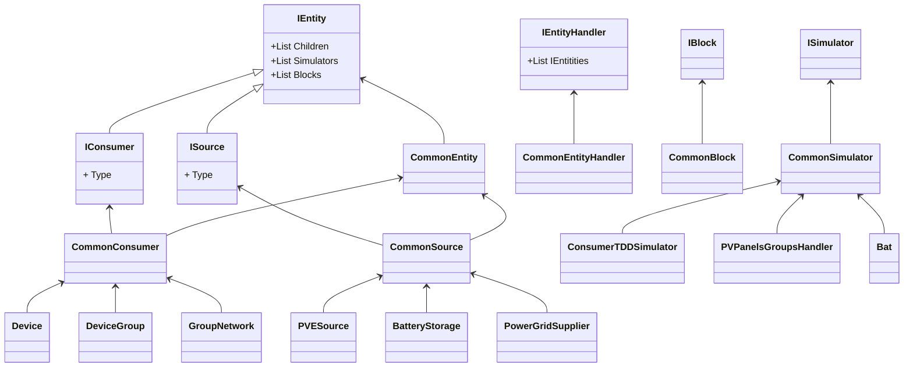

# VEDriversLite.EntitiesBlocks

Knihovna VEDriversLite.EntitiesBlocks obsahuje obecné jádro pro práci s časově ohraničenými bloky vyjadřujícími určitou hodnotu. Ačkoli je primárně zaměřena na výpočty distribuce energií, je její základní model obecný a může být využit v různých oblastech, jako je plánování cashflow, zaznamenávání časů na projektu, distribuce vzduchu a další.


## Základní struktura knihovny



## Instalace

Pro instalaci knihovny pomocí NuGet:

```bash

Install-Package VEDriversLite.EntitiesBlocks

```

## Hello World
```csharp

using VEDriversLite.EntitiesBlocks.Blocks;
using VEDriversLite.EntitiesBlocks.Consumers;
using VEDriversLite.EntitiesBlocks.Entities;
using VEDriversLite.EntitiesBlocks.Handlers;

var eGrid = new BaseEntitiesHandler();

var network = new GroupNetwork() { Type = EntityType.Consumer, Name = "house", ParentId = "parentUniqueID" };
var res = eGrid.AddEntity(network, "house", "parentUniqueID");
if (res.Item1)
{
    double[] acRun = new double[24]
                {
                0.2, 0.2, 0.2, 0.2, 0.2, 0.3, 0.3, 0.4, 0.4, 0.5, 0.5, 0.5, 0.5, 0.5, 0.5, 0.5, 0.4, 0.4, 0.3, 0.3, 0.2, 0.2, 0.2, 0.2
                    //  00,  01,  02,  03,  04,  05, 06,  07,  08,  09,  10,  11,  12,  13,  14,  15,  16,  17,  18,  19,  20,  21,  22,  23 
                };

    _ = network.AddSimulator(new DeviceSimulator(acRun, 1));


    var bilance = eGrid.GetConsumptionOfEntity(network.Id,
                                                       BlockTimeframe.Hour,
                                                       new DateTime(2023,09,24),
                                                       new DateTime(2023,09,25),
                                                       true,
                                                       true,
                                                       new List<BlockDirection>() { BlockDirection.Created, BlockDirection.Consumed },
                                                       new List<BlockType>() { BlockType.Simulated });

    await Console.Out.WriteLineAsync($"---------------------------------------:");
    await Console.Out.WriteLineAsync($"Calculated Data:");
    var total = 0.0;
    foreach (var block in bilance)
    {
        await Console.Out.WriteLineAsync($"\t{block.StartTime.ToString("yyyy_MM_dd-hh:mm")} - {block.EndTime.ToString("yyyy_MM_dd-hh:mm")}, Amount: {Math.Round(block.Amount, 2)} kWh.");
        total += block.Amount;
    }
    await Console.Out.WriteLineAsync($"Total Bilance: {total} kWh");
    await Console.Out.WriteLineAsync("--------------------END------------------:");

}

```

## Simulátory

Knihovna obsahuje různé simulátory, včetně simulátoru PVE, který dokáže simulovat pozice slunce a vypočítat výkon z umístěných panelů pod určitým úhlem a azimutem. Dále je možné přidat simulaci uložiště i spotřebičů různým způsobem. Článek věnovaný simulátorům je [zde](https://github.com/fyziktom/VirtualEconomyFramework/wiki/EntitiesBlocks---Simul%C3%A1tory-za%C5%99%C3%ADzen%C3%AD).


## Více informací

Pro podrobnější informace o knihovně a jejím využití navštivte naši [wiki](https://github.com/fyziktom/VirtualEconomyFramework/wiki#entitiesblocks).
